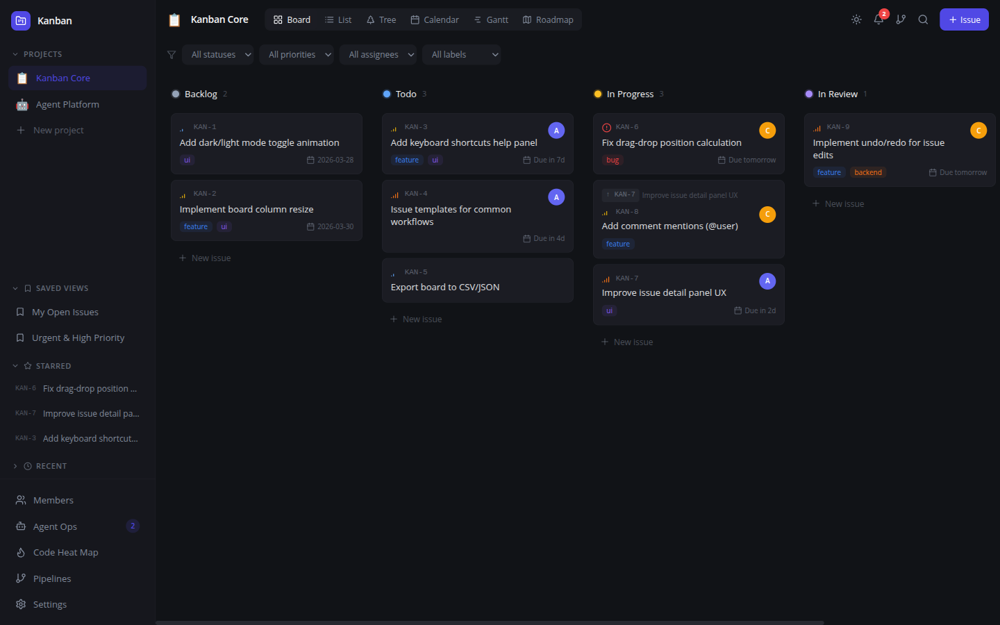
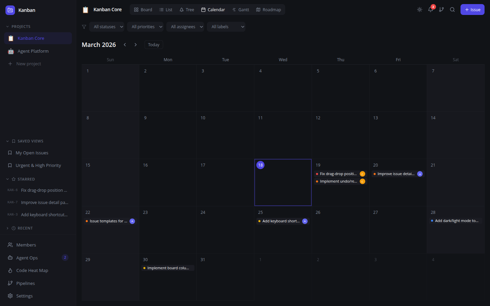
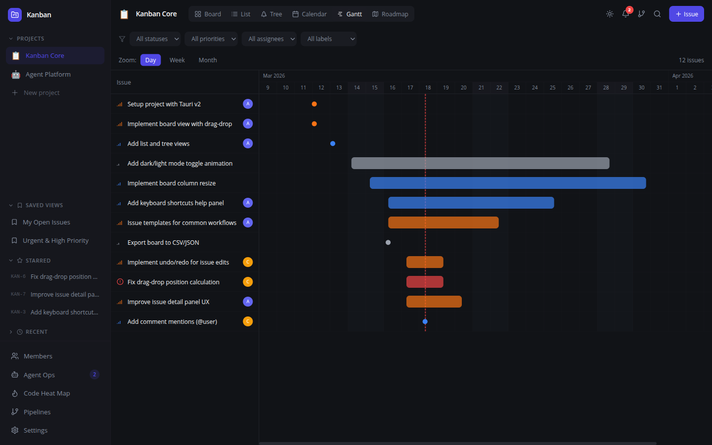
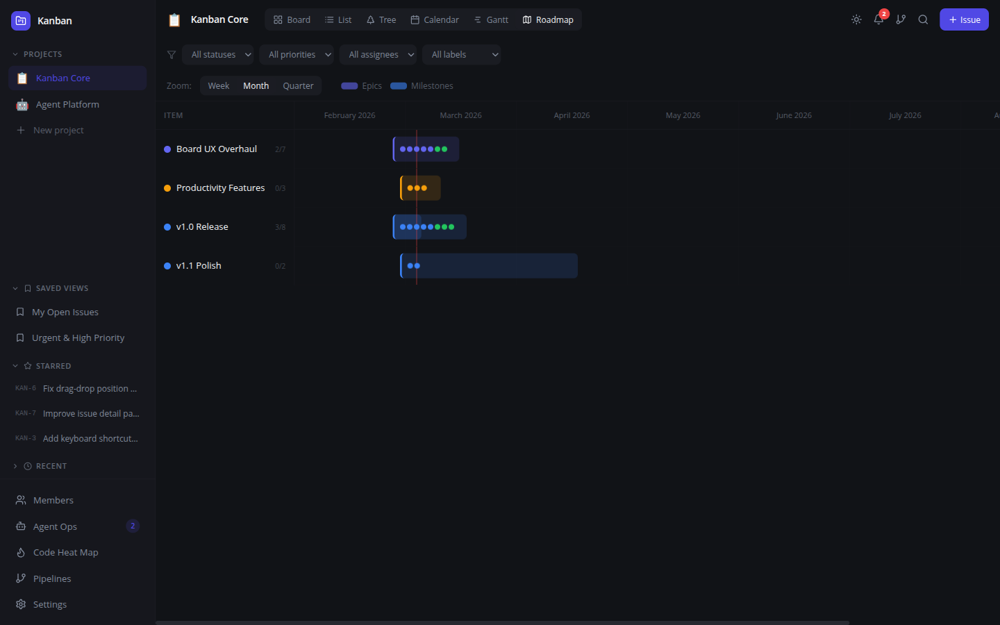
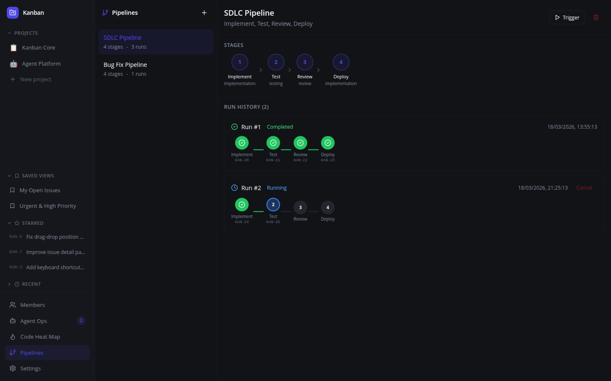
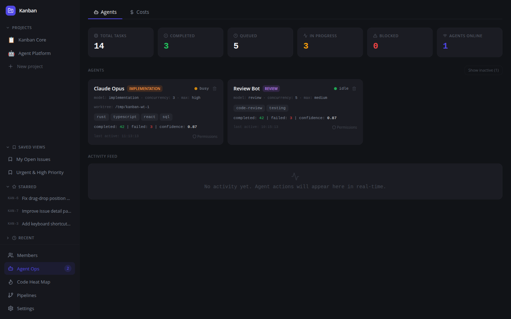
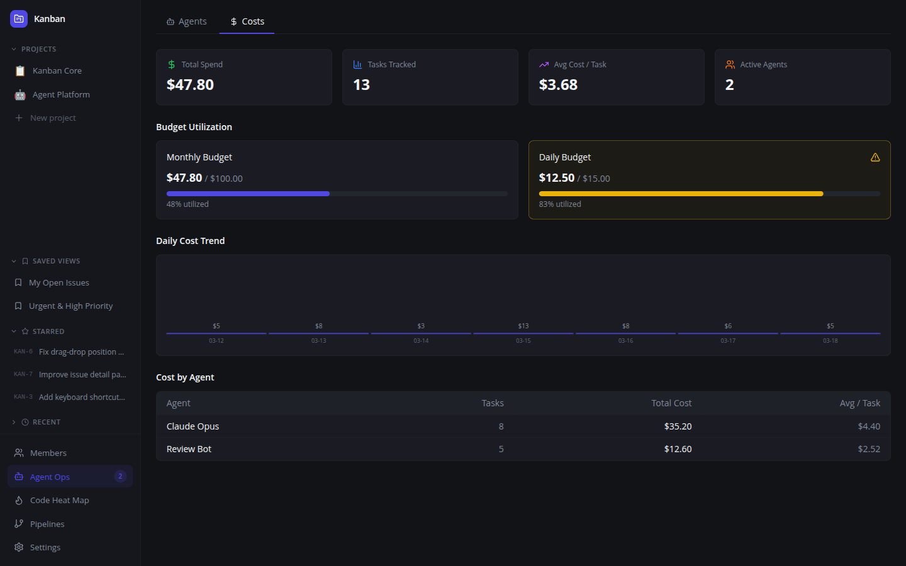
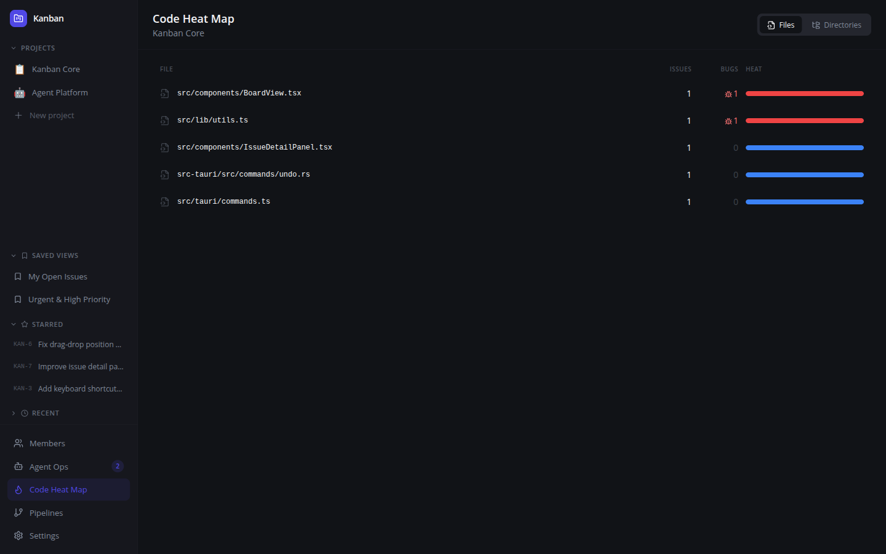
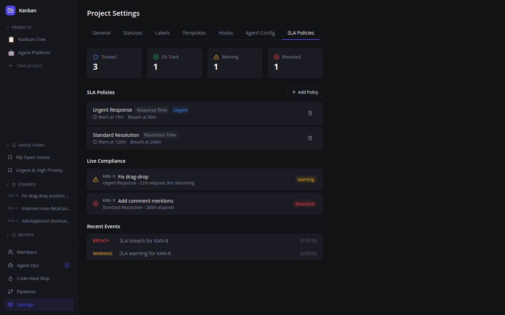

# Kanban

The first AI-agent-native project management platform. Built for orchestrating autonomous AI agents — not just tracking tasks.

Local-first. Offline-capable. Open source. Built with Tauri + React + Rust.



## Why Kanban?

Every project management tool (Linear, Jira, Shortcut) was built for humans. Kanban was built for **AI agents** — with a GUI for humans to supervise.

| | Kanban | Linear | Jira |
|---|:---:|:---:|:---:|
| Agent task contracts | Yes | No | No |
| MCP server (JSON-RPC) | Yes | Partial | No |
| Multi-agent pipelines | Yes | No | No |
| Agent sandboxing/ACLs | Yes | No | No |
| Cost tracking per task | Yes | No | No |
| SLA enforcement engine | Yes | No | No |
| Confidence-based routing | Yes | No | No |
| Execution replay | Yes | No | No |
| Local-first / offline | Yes | No | No |
| Open source | Yes | No | No |

## Features

### 6 View Modes

**Board** — Drag-and-drop kanban with priority colors, labels, assignee avatars, due dates


**Calendar** — Monthly grid showing issues by due date with today highlight


**Gantt Chart** — Horizontal timeline bars colored by priority with zoom controls (Day/Week/Month)


**Roadmap** — Epics and milestones on a timeline with progress tracking


**List** — Sortable table with WSJF score column

**Tree** — Hierarchical parent/child view

### AI Agent Orchestration

**Multi-Agent Pipelines** — Define stage chains (Implement → Test → Review → Deploy) that auto-advance when each agent completes its stage


**Agent Dashboard** — Monitor registered agents, their skills, concurrency, status, and task stats


**Cost Tracking** — Track spend per task, per agent, per project. Budget management with alerts


**Code Heat Map** — Identify which files generate the most issues and bugs


**SLA Enforcement** — Define response/resolution time policies with automatic escalation (priority bump, reassign, notify)


### Agent Intelligence

- **Auto-Triage** — Rule-based priority, label, assignee, and epic suggestion for new issues
- **Smart Decomposition** — Parse markdown checklists and headings into sub-issues
- **Natural Language Issue Creation** — `kanban issue create-from-text "fix the login crash"`
- **Task Context Assembly** — Rich context (related issues, similar completed tasks, git links, prior attempts) served to agents when claiming tasks
- **Agent-to-Agent Handoff Notes** — Structured context transfer between pipeline stages
- **Learning from Past Tasks** — Jaccard similarity matching surfaces what worked/failed on similar issues
- **WSJF Priority Scoring** — Auto-rank backlog by (business value + criticality + risk) / effort

### Agent Security

- **Fine-grained Permissions** — Per-agent ACLs for projects, file patterns, actions, task types, and cost limits
- **5 Default Presets** — Full Access, Read Only, Code Review Only, Frontend Only, Untrusted
- **Permission Checking** — Integrated into task claiming and execution logging

### Project Management

- **Epics** with colored badges
- **Milestones** with progress tracking
- **Saved custom views/filters**
- **Advanced search** with query language (`status:todo`, `priority:high`, `due:overdue`)
- **Starred** and **Recently viewed** issues
- **Issue templates** and **Custom fields**
- **@mentions** with autocomplete and notifications
- **Audit log** with actor tracking
- **Issue history** with inline diff view
- **Git integration** — Branch/PR/commit linking with auto-transition on merge
- **Recurring issues** — Cron-based auto-creation for maintenance tasks
- **Dependency graph** — Interactive SVG DAG with zoom/pan
- **Workflow automations** — Rule engine with 9 action types and template variables
- **Undo/redo** (Cmd+Z / Cmd+Shift+Z)

### Three Interfaces

| Interface | For | Protocol |
|-----------|-----|----------|
| **Desktop GUI** | Human supervision | Tauri window |
| **CLI** (`kanban`) | Scripts & agents | Shell commands |
| **MCP Server** (`kanban mcp`) | AI agents | JSON-RPC 2.0 over stdio |

All three interfaces read/write the same SQLite database. Changes from any interface are reflected in real-time across all others.

### Keyboard Shortcuts

| Shortcut | Action |
|----------|--------|
| `C` | Create issue |
| `Cmd+K` | Search (with advanced query language) |
| `Cmd+B` | Toggle sidebar |
| `1` / `2` / `3` | Board / List / Tree view |
| `4` / `5` / `6` | Calendar / Gantt / Roadmap view |
| `Cmd+Z` | Undo |
| `Cmd+Shift+Z` | Redo |
| `Escape` | Close panel/dialog |

## Installation

### Homebrew (macOS)

```bash
brew tap akassharjun/kanban https://github.com/akassharjun/kanban
```

**Desktop app:**
```bash
brew install --cask kanban
```

**CLI only:**
```bash
brew install kanban
```

### Manual

Download the latest `.dmg` (macOS) or `.deb` (Linux) from [Releases](https://github.com/akassharjun/kanban/releases).

## CLI Examples

```bash
# Issue management
kanban issue create --project 2 --title "Fix auth" --status 10 --priority high
kanban issue list --project 2 --status 10
kanban issue triage KAN-42 --apply
kanban issue decompose KAN-42 --apply
kanban issue create-from-text "fix the login crash on mobile" --project 2 --status 9
kanban issue score KAN-42 --bv 8 --tc 7 --rr 5 --size 3
kanban issue rank --project 2

# Agent operations
kanban marketplace list
kanban marketplace register --name "Claude" --provider claude --skills rust,react
kanban task context KAN-42
kanban task handoff KAN-42 --from agent-1 --type completion --summary "Implemented fix"
kanban task learn KAN-42 --outcome success --approach "Used retry pattern"

# Pipelines
kanban pipeline list --project 2
kanban pipeline trigger 1

# Code analysis
kanban code heat-map --project 2
kanban issue from-diff --project 2 --file src/main.rs --title "Bug in parser" --severity bug

# Cost & SLA
kanban costs summary --project 2
kanban sla check --project 2
kanban sla enforce --project 2
```

## MCP Tools (40+)

The MCP server exposes tools for AI agents via JSON-RPC 2.0:

```bash
# Start MCP server
kanban mcp
```

**Issue management:** `create_issue`, `update_issue`, `list_issues`, `search_issues`, `move_issue`, `bulk_update`

**Agent lifecycle:** `register_agent`, `agent_heartbeat`, `next_task`, `start_task`, `complete_task`, `fail_task`

**Intelligence:** `triage_issue`, `auto_triage`, `decompose_issue`, `create_from_text`, `find_similar_learnings`

**Context:** `get_task_context`, `file_heat_map`, `create_issue_from_diff`

**Orchestration:** `create_pipeline`, `trigger_pipeline`, `advance_pipeline`

**Marketplace:** `marketplace_register`, `marketplace_search`, `find_best_agent`

**Monitoring:** `record_cost`, `check_budget`, `check_sla`, `enforce_sla`

## Tech Stack

| Layer | Technology |
|-------|-----------|
| Desktop Shell | Tauri v2 (Rust backend) |
| Frontend | React 18, TypeScript, Vite |
| Styling | Tailwind CSS, shadcn/ui components |
| Database | SQLite (sqlx, WAL mode) |
| Drag & Drop | @dnd-kit/core |
| HTTP Client | reqwest (GitHub API) |
| Markdown | react-markdown + remark-gfm |

## Development

```bash
# Install dependencies
npm install

# Run frontend dev server
npm run dev

# Run Tauri desktop app (dev mode)
cargo tauri dev

# Build for production
cargo tauri build

# Run tests
npm run test:run

# Type check
npx tsc --noEmit
```

## Data Storage

All data is stored locally in `~/.kanban/data.db` (SQLite with WAL mode). No cloud, no accounts, no telemetry. Full data ownership.

## License

MIT
